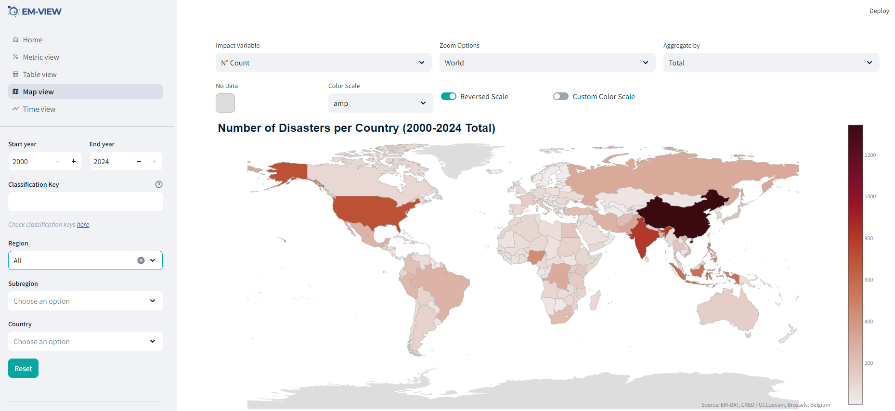

# EM-VIEW: A Community Dashboard for your EM-DAT Data



**EM-VIEW** is a [Streamlit](https://streamlit.io/) web application designed to visualize 
the [EM-DAT International Disaster Database](https://www.emdat.be/) XLSX datasets.

The dashboard features multiple analytical views:

- **Metric view** – key impact indicators by disaster type
- **Table view** – full dataset exploration with column filtering
- **Map view** – global and regional impact maps by country
- **Time view** – yearly-aggregated impact timelines

You can download EM-DAT data by registering at the  
[EM-DAT Public Data Portal](https://public.emdat.be/).

---

## ⚠️ Origin and Contributions

> 🧾 **This repository is an adaptation of an original open-source EM-VIEW implementation**  
by the EM-DAT team. The initial version was developed under the EM-DAT project with support from USAID.  
SAEON (South African Environmental Observation Network) contributed modifications to:
- Adapt the interface for local/regional analysis
- Introduce PostgreSQL as a backend source
- Add Docker and Dev Container support for streamlined deployment

We do **not claim authorship of the original codebase** — only the enhancements made in this forked version.

---

## 🚀 Run the App via Dev Container (Recommended for VSCode)

This project is fully configured for use with **Visual Studio Code + Dev Containers**.

### ✅ Requirements:
- Docker (or Podman) installed
- VSCode + Dev Containers extension

### ▶️ To start:
1. Open the folder in VSCode
2. Reopen in Dev Container when prompted
3. Once container is ready, run:

```bash
streamlit run app.py
```

Access the app at [http://localhost:8501](http://localhost:8501)

---

## 🐳 Run with Docker Compose (Alternative)

```bash
docker compose up --build
```

- Automatically installs dependencies
- Runs the Streamlit app at [http://localhost:8501](http://localhost:8501)

You can customize database credentials via `.env`.

---

## 🔧 Manual Setup (non-container users)

If not using Docker or Dev Containers:

### 1. Install Dependencies

```bash
pip install -r requirements.txt
```

### 2. Run App

```bash
streamlit run app.py
```

---

## 📄 License

MIT — see `LICENSE` file.  
Note: This license covers only the software in this repository.  
The EM-DAT dataset itself is governed by separate [EM-DAT Terms of Use](https://doc.emdat.be/docs/legal/).

---

## 🙏 Acknowledgement

Original EM-VIEW development was led by the EM-DAT team with support from USAID.  
This adapted version includes contributions by **SAEON** for deployment and integration enhancements tailored to regional use cases in Southern Africa.